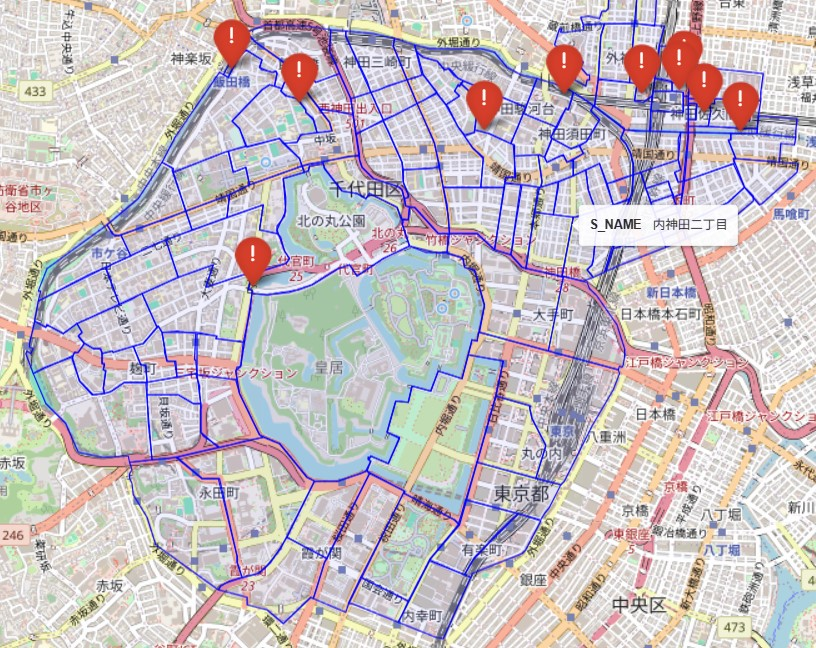
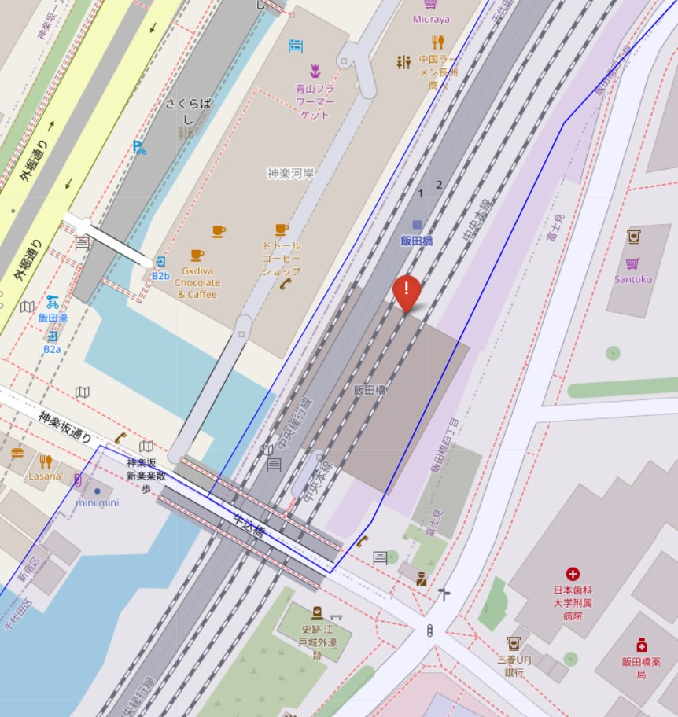

# TCE: Topological Constraint Engine

**A high-precision Japanese address verification engine using Nearest Neighbor (Voronoi) logic.**

## 📖 Overview
TCE (Topological Constraint Engine) is a Python-based geospatial tool designed to validate and resolve Japanese addresses with extreme precision. It maps coordinate data (GPS/Geocoding results) to administrative boundaries (Chome/Town polygons).

By shifting from traditional "Point-in-Polygon" containment checks to **Voronoi-based Nearest Neighbor logic**, TCE solves the "road gap" problem inherent in Japanese administrative data, achieving **99.4% accuracy** in the Chiyoda-ku validation dataset.

## 💥 The Problem: "Road & River Gaps"
Japanese administrative boundary data (e.g., from e-Stat) typically defines "blocks" (Gaiku) where people live, often excluding roads, rivers, and railways.
* **Traditional Approach (Point-in-Polygon):** Points located on roads or rivers fall into "no man's land" (Outside of Bounds), resulting in validation errors.
* **Buffer Approach:** Simply expanding the polygon boundaries (Buffering) fails to handle wide avenues (>20m) without causing overlaps in narrow alleys.

## 💡 The Solution: Voronoi Logic
TCE implements a **Nearest Neighbor Classification** approach.
Instead of asking *"Is this point INSIDE a polygon?"*, TCE asks *"Which polygon is NEAREST to this point?"*

This mathematically simulates a **Voronoi Diagram** using road centerlines as boundaries, ensuring that every point—even those in the middle of a wide highway or river—is assigned to the correct administrative district.

## 🚀 Performance (v0.1 Prototype)
Verified using Ministry of Land, Infrastructure, Transport and Tourism (MLIT) location reference data for Chiyoda City, Tokyo.

| Metric | Result | Notes |
| :--- | :--- | :--- |
| **Accuracy** | **99.43%** | 1743/1753 points correctly matched |
| **Logic** | Nearest Neighbor | Solved 100% of "Out of Bounds" errors |
| **Errors** | 10 points (0.57%) | Attributed to "Border Jitter" (data inconsistencies at building entrances vs. centroids) |

### 📊 Validation Evidence
Visual confirmation of the validation results in Chiyoda City.

*Figure 1: Validation Overview - Achieved 99.43% accuracy across 1,753 data points. By shifting to Voronoi-based Nearest Neighbor logic, the engine successfully resolved "road gap" issues.*

 

*Figure 2: Error Audit (No. 1402 @ Iidabashi) - Investigating the remaining 0.6% outliers. The red dot (coordinate) sits just meters outside the blue boundary due to dataset discrepancies ("Border Jitter"). This confirms that the logic has reached the theoretical limit.*

## 🛠️ Tech Stack
* **Core:** Python 3.10+
* **Geospatial:** `geopandas`, `dask-geopandas`, `pyogrio`, `shapely`
* **Visualization:** `folium`
* **Environment:** Designed for Google Colab (Cloud Runtime)

## 📂 Data Preparation
To run the prototype, you need to download the official Japanese administrative data.
Please confirm the terms of use for each data source.

### 1. Boundary Data (Shapefile)
* **Source:** [e-Stat (Portal Site of Official Statistics of Japan)](https://www.e-stat.go.jp/)
* **Dataset:** Map of Boundary Zones (Small Area) / 境界データ（小地域）
* **Format:** World Geodetic System (JGD2011) / 世界測地系緯度経度・JGD2011

### 2. Reference Data (CSV)
* **Source:** [MLIT Location Reference Information Download Service](https://nlftp.mlit.go.jp/isj/)
* **Dataset:** Gaiiku (Block) Level Position Reference Info / 街区レベル位置参照情報

### 3. Setup
1. Create a folder named `data` in your Google Drive (e.g., `/TCE_Project/data`).
2. Upload the downloaded `.zip` files directly into this folder.
   * *Note: TCE is designed to automatically detect and load valid zips.*

## 📦 Usage
This repository contains the Jupyter Notebook for the prototype.
1. Open `TCE_v0.1_Core_Prototype.ipynb` in Google Colab.
2. Upload your Shapefile (Boundary) and CSV (Reference Data).
3. Run the cells to execute the Nearest Neighbor validation.

## 📄 License
This project is licensed under the MIT License - see the [LICENSE](LICENSE) file for details.
